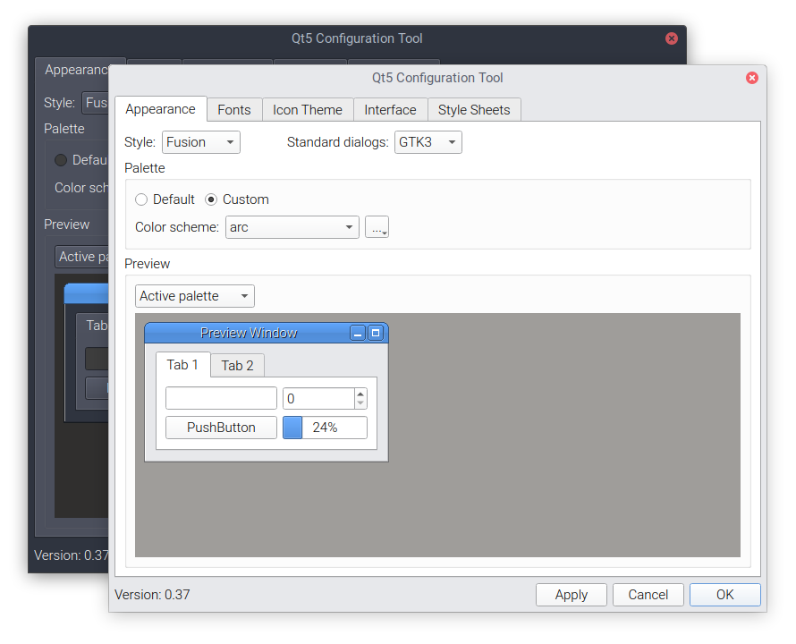

# Qt Arc Theme ColorScheme

[GTK/GNOME Arc Theme](https://github.com/horst3180/arc-theme) - Qt color scheme for qt5ct



## Installing

```
$ sudo apt install qt5ct
```

Log out and log back in

```
$ git clone https://github.com/t0pu/qt-arc-theme-colorscheme.git
$ cp qt-arc-theme-colorscheme/*.conf ~/.config/qt5ct/colors/
$ rm -rf qt-arc-theme-colorscheme
```

* Open qt5ct
* Under "Palette" select "Custom"
* Select "arc" or "arc-dark" from the dropdown as you like
* Hit "Apply" and "OK"

Done!

<br/>

---

#### Additional Info

Font settings used in screenshot:

Interface Text: Roboto Light, 11pt  
Legacy Window Titles: Roboto Light, 11pt  
Hinting: Slight  
Antialiasing: Subpixel

-> set in GNOME Tweak Tool
